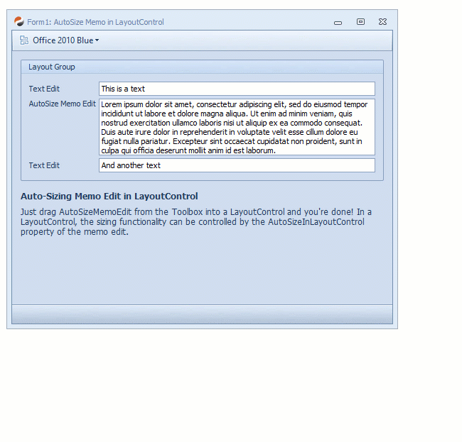
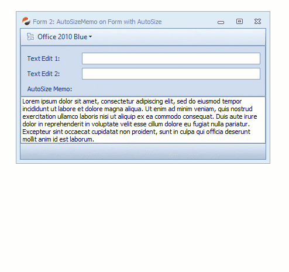

## DxUltimate Sample: AutoSizeMemoEdit - Auto-Sizing MemoEdit Control 

### 1. Introduction 

DevExpress WinForms controls employ multiple different mechanism for automatic sizing of controls. I'll just name the three that are relevant in this case:

1. **WinForms.Control.AutoSize**  
  The normal auto-sizing mechanism provided by the WinForms framework
2. **DevExpress.XtraEditors.BaseControl.AutoSizeInLayoutControl**  
  A DX specific mechanism for autosizing controls inside a LayoutControl
3. **DevExpress.XtraEditors.Controls.IAutoHeightControl**  
  Another DC specific mechanism which is focusing on automatic height. Its primary purpose seems to be autosizing editors inside grid and list controls to allow variable row heights

The MemoEdit control implements #3, but not #1 and #2. I'm not sure about the reason, but I suspect that the intention might have been to avoid confusion with AutoSize (#1) when the MemoEdit is used in DataGrid & Co.

### 2. The Problem

Is simple: You cannot use the MemoEdit in a form/control and neither in a LayoutControl and let it autosize by its contents, because #1 and #2 are not implemented.

### 3. Solution

This example includes an inherited MemoEdit control: **AutoSizeMemoEdit**

The AutoSizeMemoEdit control implements both missing autosizing mechanisms (#1 and #2), and nothing else is required than placing it on a form or control or on a LayoutControl.

### 4. Examples

#### In LayoutControl

Scrollbars are set to False by default and AutoSizeInLayoutControl is set to True:

#### In AutoSize-Form 

The AutoSize property of the AutoSizeMemoEdit is set to True and AutoSizeMode to GrowOrShrink.
Finally, AutoSize of the Form is set to True as well, resulting in the complete form resizing when editing:

#### In Form with Dock Panels

In this case, the form is not set to AutoSize and the AutoSizeMemoEdit control is automatically resizing itself to show all of its contents:

